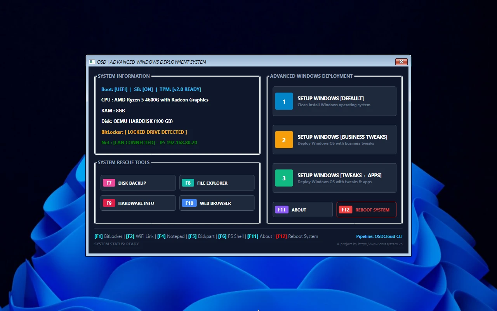
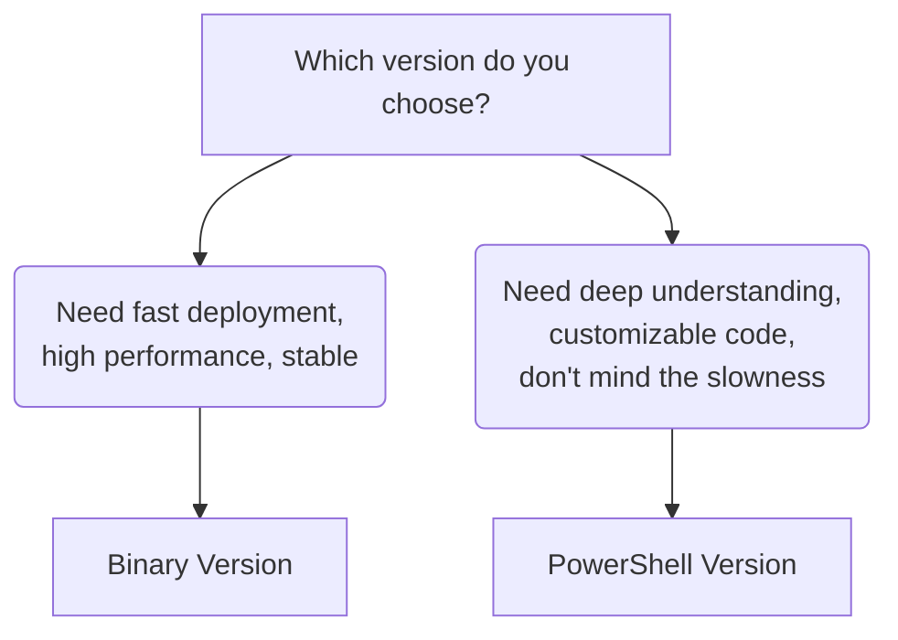

# OSD Project - Advanced Windows Deployment System

---

## Introduction

OSD project by CoreSystem is an advanced Windows deployment system built on OSDeploy/OSDCloud. It streamlines Windows installation to be fast, secure, and enterprise-ready.

---

## Objectives

- **Clean Sources:** Always deploy from official Microsoft sources with latest updates
- **Speed:** Save several hours per machine compared to typical installation processes
  - Flow 2 (Business Tweaks): 13-15 minutes
  - Flow 3 (Tweaks + Apps): 20-25 minutes
  - Depends on network speed and number of applications to install
- **Maximum Security:** Uses original Microsoft WinPE, 100% compatible with latest security standards (SecureBoot, TPM 2.0)
- **Enterprise Customization:** Bloatware removal, pre-installing essential office apps
- **Integrated Tools:** Hardware diagnostics, partition management, disk backup
- **100% Legal:** No paid software used
- **Wide Hardware Support:** HP, Dell, Lenovo and many more

---

## Screenshot



---

## Quick Start

Choose the version that fits your needs:



| Version | Target Audience | Description |
|---------|-----------------|-------------|
| **[Binary](./Getting-Started-Binary.md)** | IT Technicians | C# WPF (.NET 10) - Performance optimized |
| **[PowerShell](./Getting-Started-PS.md)** | IT Enthusiasts | Native PowerShell - Fully customizable |

---

## Project Structure

```
OSD.Project/
├── Resources/
│   ├── coresystem-ng.ps1           # Main file (PowerShell)
│   ├── SetupFiles/                 # Configuration files
│   │   ├── unattend.xml
│   │   ├── post-setup-tweaks.ps1
│   │   └── post-setup-combo.ps1
│   └── Next-Step/
│       ├── next-step-tweaks.ps1
│       └── next-step-combo.ps1
├── Misc/
├── README.md
├── README.en.md
├── LICENSE
├── DISCLAIMER.md
├── Getting-Started-Binary.md
├── Getting-Started-PS.md
└── advanced-topics.md
```

---

## Version Comparison

| Component | Binary | PowerShell |
|-----------|--------|------------|
| **Target** | IT Technicians | IT Enthusiasts |
| **Main File** | coresystem.exe | coresystem-ng.ps1 |
| **Launcher** | winpeshl.ini | startnet.cmd |
| **ISO Size** | ~1.3GB | ~1.1GB |
| **Customization** | Limited | Unlimited |

---

## Documentation

- **[Getting Started (Binary)](./Getting-Started-Binary.md)** - For IT technicians
- **[Getting Started (PowerShell)](./Getting-Started-PS.md)** - For IT enthusiasts
- **[Advanced Topics](./advanced-topics.md)** - Deep-dive documentation

---

## Contact

- **Website:** https://osd.coresystem.vn
- **GitHub:** https://github.com/coresystemvn/OSD.Project
- **Release:** https://github.com/coresystemvn/OSD.Project/releases
