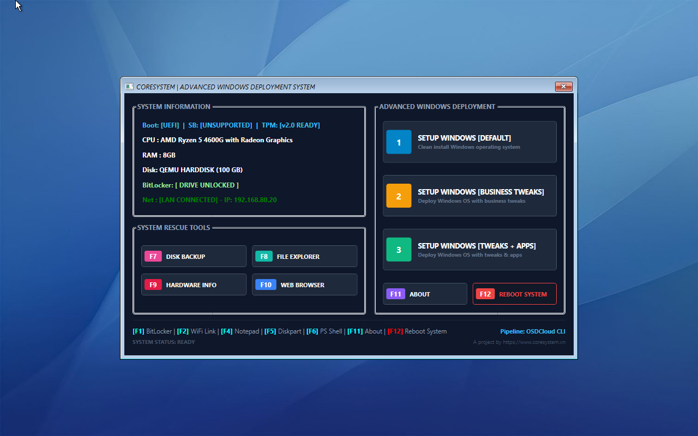

### OSD Project by CORESYSTEM

[[English version](./README.en.md)]

## Tiêu chí

- Luôn luôn cài đặt **nguồn sạch từ Microsoft** và update mới nhất
- Toàn bộ thời gian cài đặt chỉ gói gọn **trong 30-45 phút** tùy tốc độ mạng Internet 
- Tùy biến **automation chuẩn doanh nghiệp** thông qua việc xóa các ứng dụng bloatware có sẵn trong Windows, cài đặt bổ sung ứng dụng phù hợp môi trường văn phòng
- Đáp ứng **tối đa nền tảng phần cứng bảo mật hiện đại** khi các hãng thiết bị bắt đầu siết chặt việc áp dụng firmware UEFI kết hợp khóa SecureBoot và chip bảo mật TPM2
- Ngoài tính năng chủ đạo là cài đặt Windows thì hệ thống boot cũng tích hợp các công cụ bổ sung như kiểm tra phần cứng máy tính, quản lý phân vùng và sao lưu ổ đĩa giúp việc cài đặt an toàn, yên tâm hơn
- **100% hợp pháp**, hệ thống không dùng bất kỳ phần mềm thương mại nào có thể gây ảnh hưởng trực tiếp hoặc gián tiếp tới các tranh chấp pháp lý doanh nghiệp
- Phù hợp cho **đa dạng thiết bị phần cứng** từ các công ty như HP, Dell, Lenovo...

Bản nâng cấp mới theo định hướng tối ưu tối đa workflow cho quy trình cài đặt cho doanh nghiệp bằng việc tái cấu trúc luồng cài đặt, bộ công cụ, tạo mới hoàn toàn logic kết nối wifi cũng như xử lý ổ đĩa mã hóa Bitlocker cũng như giúp thao tác nhanh hơn qua hệ thống phím tắt

## Minh họa

Hệ thống hóa các cụm chức năng gồm thông tin sơ bộ hệ thống, cụm công cụ hỗ trợ cứu hộ máy và quan trọng nhất luồng setup Windows được tối ưu lại đủ cho nhu cầu của đa số doanh nghiệp với 3 tùy chọn sẵn. IT có thể tùy biến linh hoạt bằng cách điều chỉnh nội dung các file trong phần **Resources & Scripts** trước khi build .iso

