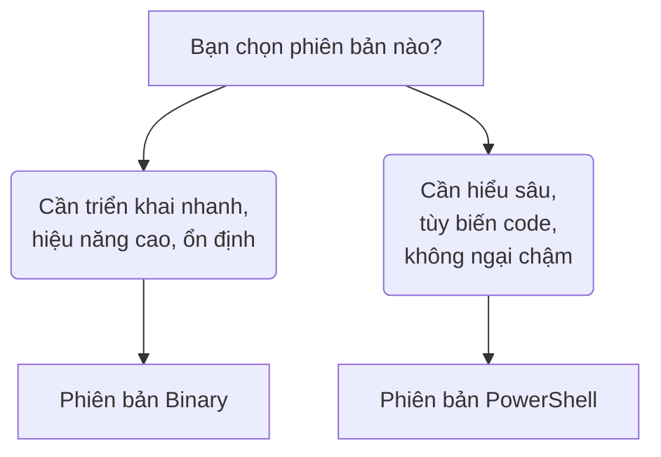

# OSD Project - Advanced Windows Deployment System

[[English version](./README.en.md)]

---

## Giới thiệu

OSD Project by CoreSystem là hệ thống triển khai Windows tiên tiến, được xây dựng trên nền tảng OSDeploy/OSDCloud. Hệ thống giúp quá trình cài đặt Windows trở nên nhanh chóng, bảo mật và phù hợp cho môi trường doanh nghiệp.

> **Lưu ý cho Doanh nghiệp:** Đây là dự án cộng đồng, được cung cấp theo nguyên trạng ("as-is"). Chúng tôi khuyến nghị kiểm thử kỹ lưỡng trong môi trường sandbox trước khi triển khai thực tế. Để đảm bảo tính ổn định tối đa trước các thay đổi từ OSDCloud gốc, vui lòng ưu tiên sử dụng các module đã được "đóng băng" (frozen) trong thư mục `Misc/`.

---

## Tiêu chí

- **Nguồn sạch:** Luôn cài đặt từ Microsoft chính hãng với bản cập nhật mới nhất
- **Tốc độ:** Tiết kiệm vài giờ đồng hồ mỗi máy so với quy trình cài đặt thông thường
  - Flow 2 (Business Tweaks): 13-15 phút
  - Flow 3 (Tweaks + Apps): 20-25 phút
  - Phụ thuộc tốc độ mạng và số ứng dụng cần cài
- **Bảo mật tối đa:** Dùng WinPE gốc Microsoft, tương thích 100% các chuẩn bảo mật mới nhất (SecureBoot, TPM 2.0)
- **Tùy biến doanh nghiệp:** Xóa bloatware, cài ứng dụng văn phòng phù hợp
- **Công cụ tích hợp:** Kiểm tra phần cứng, quản lý phân vùng, sao lưu ổ đĩa
- **100% hợp pháp:** Không dùng bất kỳ phần mềm có phí nào
- **Đa thiết bị:** HP, Dell, Lenovo và nhiều hãng khác

---

## Minh họa


---

## Bắt đầu ngay

Chọn phiên bản phù hợp với nhu cầu của bạn:



| Phiên bản | Đối tượng | Mô tả |
|-----------|-----------|-------|
| **[Binary](./Getting-Started-Binary.md)** | Kỹ thuật viên IT | C# WPF (.NET 10) - Tối ưu hiệu năng |
| **[PowerShell](./Getting-Started-PS.md)** | Đam mê IT | Native PowerShell - Tùy biến tối đa |

---

## Cấu trúc dự án

```
OSD.Project/
├── Resources/
│   ├── coresystem-ng.ps1           # File chính (PowerShell)
│   ├── SetupFiles/                 # File cấu hình
│   │   ├── unattend.xml
│   │   ├── post-setup-tweaks.ps1
│   │   └── post-setup-combo.ps1
│   └── Next-Step/
│       ├── next-step-tweaks.ps1
│       └── next-step-combo.ps1
├── Misc/
├── README.md
├── README.en.md
├── LICENSE
├── DISCLAIMER.md
├── Getting-Started-Binary.md
├── Getting-Started-PS.md
└── advanced-topics.md
```

---

## So sánh hai phiên bản

| Thành phần | Binary | PowerShell |
|------------|--------|------------|
| **Đối tượng** | Kỹ thuật viên IT | Đam mê IT |
| **File chính** | coresystem.exe | coresystem-ng.ps1 |
| **Launcher** | winpeshl.ini | startnet.cmd |
| **Kích thước ISO** | ~1.3GB | ~1.1GB |
| **Tùy chỉnh** | Giới hạn | Không giới hạn |

---

## Tài liệu

- **[Getting Started (Binary)](./Getting-Started-Binary.md)** - Dành cho IT technicians
- **[Getting Started (PowerShell)](./Getting-Started-PS.md)** - Dành cho IT enthusiasts
- **[Advanced Topics](./advanced-topics.md)** - Chủ đề nâng cao

---

## Liên hệ

- **Website:** https://osd.coresystem.vn
- **GitHub:** https://github.com/coresystemvn/OSD.Project
- **Release:** https://github.com/coresystemvn/OSD.Project/releases
